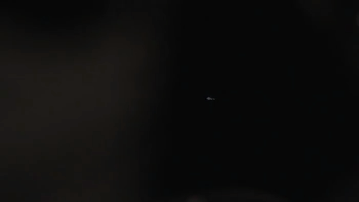

## [qumoptly.github.io 的说明：](https://qumoptly.github.io)
#### 【个人学习记录整理：资源源于网络，经修改整理，仅供学习使用；如有侵权，请联系删除，谢谢！】
***
### [1.激光器：](https://qumoptly.github.io/laser/) Thanks goes to these wonderful people! [arnold neracher]

### [2.PoseNet：](https://qumoptly.github.io/posenet/) 在浏览器上使用 TensorFlow.js 实时运行人体姿态检测！ 

>* [BodyPix](https://qumoptly.github.io/body-pix/) 

### [3.Tiny YOLO：](https://qumoptly.github.io/tfjs-yolo-tiny/) 在浏览器上使用Tensorflow.js实现目标检测！ 

### [4.NASA火星车：](https://github.com/nasa-jpl/open-source-rover) the rovers on Mars！ 

### [5.Quirk：](https://qumoptly.github.io/quirk/)一个量子电路模拟器！

### 6.其他 ... 

>* [light.co](https://qumoptly.github.io/light.co/)
>* [silk](https://qumoptly.github.io/silk/)
>* [vfm2](https://qumoptly.github.io/vfm2)

***